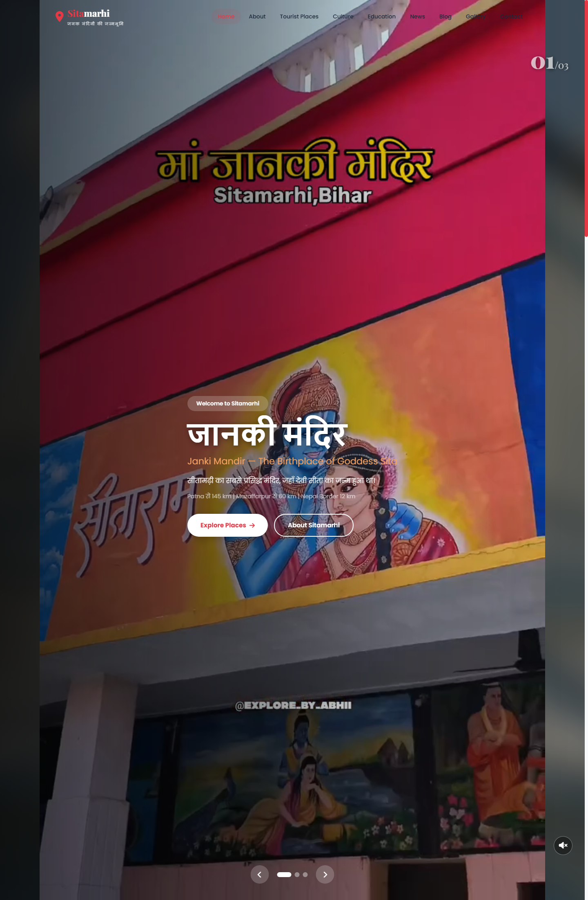
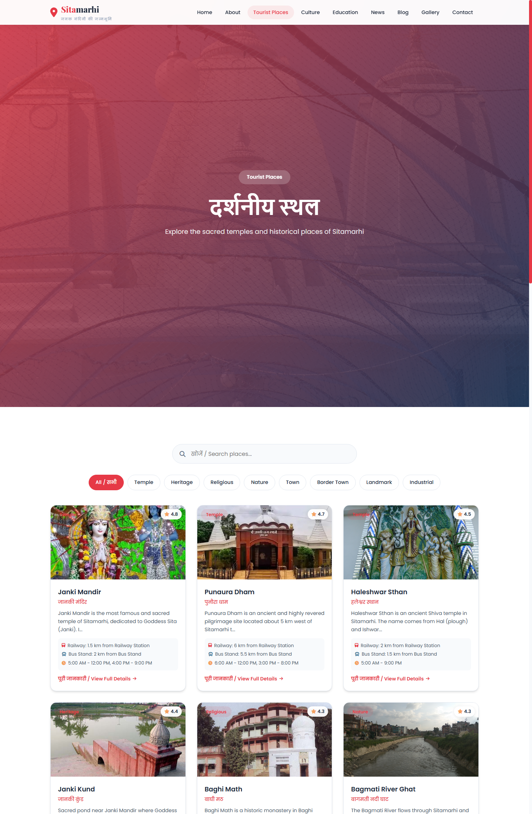

# Janki Mandir — Sitamarhi Tourism Website (Case Study)

A full SEO-optimized tourism website for **Sitamarhi, Bihar**, built around Janki Mandir — the birthplace of Goddess Sita. Personal project, not client work.

> **Source code is private.** This repo is a public case study — screenshots, scope, and what was built — without exposing the codebase.

## Overview

- **Stack:** PHP + MySQL
- **Scope:** Content-complete tourism site with ~15 researched tourist places, temple/heritage info, how-to-reach details, photo gallery, blog, and local news
- **SEO/technical work:** clean URLs (`.htaccess`), per-page meta/OG/JSON-LD schema, `robots.txt` + `sitemap.php` + `llms.txt`, real Wikimedia Commons photography
- **Security fixes:** patched SQL injection across every admin form, fixed a broken `SITE_URL` config, repaired a dead blog section (a `status`/`is_published` column mismatch)

## Screenshots

### Home

### Tourist Places

### Photo Gallery

## Links

- Portfolio: [mukeshkumar356.github.io](https://mukeshkumar356.github.io)
- GitHub: [github.com/mukeshkumar356](https://github.com/mukeshkumar356)
